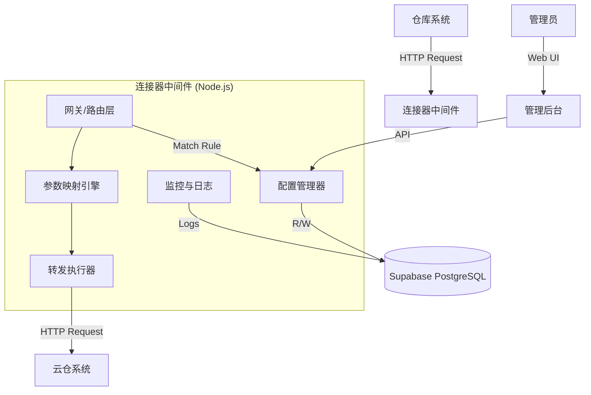

# 连接器中间件项目 - 技术架构文档

## 1. 技术选型

### 1.1 后端 (核心转发引擎 & 管理 API)

* **Runtime**: Node.js (LTS 版本) - 利用其非阻塞 I/O 处理高并发请求。

* **Framework**: Express.js 或 Fastify (推荐 Fastify 以获得更高性能)。本项目初期使用 **Express.js** 以利用其丰富的中间件生态，后续可优化。

* **Language**: TypeScript - 保证代码类型安全和可维护性。

### 1.2 前端 (管理后台)

* **Framework**: React 18

* **Build Tool**: Vite

* **Styling**: Tailwind CSS

* **State Management**: Zustand

* **Router**: React Router v6

### 1.3 数据存储与配置

* **Database**: Supabase (PostgreSQL)

  * 存储路由规则、映射配置、用户账户。

  * 存储变更日志。

* **Caching (配置热更新)**:

  * 内存缓存 (In-Memory): 服务启动时从 DB 加载所有配置到内存，请求处理时直接读取内存，保证极低延迟。

  * 更新机制: 管理 API 更新 DB 后，发布事件通知所有服务实例刷新内存缓存 (可通过 Redis Pub/Sub 或简单的轮询/Webhook 机制，本项目简化为单实例或简单的内存刷新)。

### 1.4 其他组件

* **HTTP Client**: Axios 或 Undici (Node.js 内置 fetch) 用于发起转发请求。

* **Validation**: Zod 或 Joi 用于参数校验和配置校验。

* **Resilience**: `axios-retry` 或 `cockatiel` 实现重试和熔断。

* **Logging**: Winston 或 Pino。

## 2. 系统架构设计



## 3. 核心模块设计

### 3.1 路由与转发模块

* **Middleware Chain**:

  1. `RequestLogger`: 记录入站请求。
  2. `RouteMatcher`: 根据 URL 和 Method 匹配内存中的路由规则。
  3. `BodyParser`: 解析 JSON 请求体。
  4. `Mapper`: 根据配置的 JSON Path 映射规则转换 Body。
  5. `Forwarder`: 构造新的 HTTP 请求发送给下游。
  6. `ResponseHandler`: 处理下游响应，透传回客户端。

### 3.2 映射引擎

* 支持简单的 Key-Value 映射。

* 支持 JSONPath 提取和重组。

* 示例配置结构:

  ```json
  {
    "mappings": [
      { "source": "aa", "target": "a" },
      { "source": "nested.bb", "target": "flat_b" }
    ],
    "keep_unmapped": true
  }
  ```

### 3.3 动态配置与热更新

* **Config Store**: 一个单例类，维护当前所有的生效规则。

* **Update Strategy**:

  * 每次管理 API 修改配置成功后，更新 DB，并调用 `ConfigStore.reload()`。

  * 对于多实例部署，可预留 `/api/internal/reload` 接口供 Webhook 调用，或使用 Supabase Realtime 监听配置表变更。

## 4. 数据库设计 (Supabase)

### 4.1 表结构

#### `routes` (路由规则表)

\| 字段名 | 类型 | 说明 |
|Data Type|Description|
\|---|---|---|
\| id | uuid | 主键 |
\| name | varchar | 规则名称 |
\| source\_path | varchar | 监听路径 (如 /api/v1/inbound) |
\| target\_url | varchar | 目标 URL (如 <https://target.com/api/receive>) |
\| method | varchar | HTTP 方法 (POST, GET, etc.) |
\| mapping\_config | jsonb | 字段映射配置 |
\| status | varchar | 状态 (active/inactive) |
\| created\_at | timestamp | 创建时间 |
\| updated\_at | timestamp | 更新时间 |
\| version | int | 当前版本号 |

#### `route_logs` (请求日志表 - 可选，高并发建议仅输出文件或专门的日志系统)

| 字段名           | 类型        | 说明       |
| ------------- | --------- | -------- |
| id            | uuid      | 主键       |
| route\_id     | uuid      | 关联的路由 ID |
| request\_path | varchar   | 请求路径     |
| status\_code  | int       | 响应状态码    |
| latency\_ms   | int       | 耗时 (毫秒)  |
| error\_msg    | text      | 错误信息     |
| created\_at   | timestamp | 请求时间     |

#### `config_history` (配置变更历史)

| 字段名         | 类型        | 说明    |
| ----------- | --------- | ----- |
| id          | uuid      | 主键    |
| route\_id   | uuid      | 关联路由  |
| old\_config | jsonb     | 修改前配置 |
| new\_config | jsonb     | 修改后配置 |
| changed\_by | uuid      | 修改人   |
| created\_at | timestamp | 修改时间  |

## 5. API 定义 (管理端)

* `GET /api/routes`: 获取规则列表

* `GET /api/routes/:id`: 获取单条规则详情

* `POST /api/routes`: 创建新规则

* `PUT /api/routes/:id`: 更新规则

* `DELETE /api/routes/:id`: 删除规则

* `POST /api/routes/:id/rollback`: 回滚规则配置

## 6. 项目结构规划

```
/
├── src/
│   ├── client/          # React 前端代码
│   │   ├── components/
│   │   ├── pages/
│   │   └── ...
│   ├── server/          # Node.js 后端代码
│   │   ├── core/        # 核心引擎 (转发、映射)
│   │   ├── api/         # 管理 API
│   │   ├── config/      # 配置加载
│   │   └── middleware/  # Express 中间件
│   └── shared/          # 前后端共享类型
├── supabase/
│   └── migrations/      # 数据库迁移文件
├── package.json
└── ...
```

